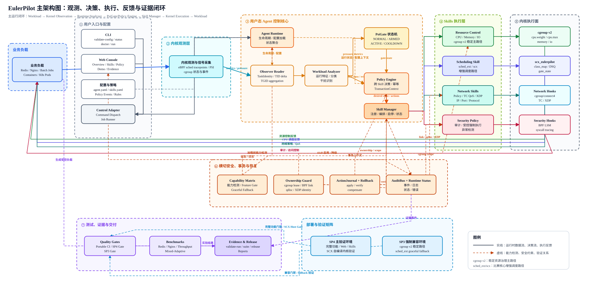

# EulerPilot

> 面向 openEuler 的自适应资源管控 Agent。文档更新时间：`2026-07-27`；当前进入最终交付收口阶段，代码、证据、Web Console、用户手册和答辩材料按 SP4 主验证 + SP3 强制兼容矩阵收口。

EulerPilot 不是单一调度器 demo，而是一套围绕“观测 -> 决策 -> 执行 -> 反馈 -> 证据”的系统级 Agent 框架。项目使用 eBPF/PSI 感知 workload 和系统压力，在用户态完成分类、策略决策和 Skill 编排，并通过 `cgroup v2`、`sched_ext/scx`、TC/XDP、BPF LSM 等系统控制器完成可审计、可回滚的资源管控。

## 当前最强状态

| 项目 | 当前口径 |
|------|----------|
| 核心验证线 | `192.168.1.123:/root/EulerPilot`，openEuler 24.03 LTS SP4 |
| SP3 强制兼容线 | `192.168.1.121:/root/EulerPilot`，openEuler 24.03 LTS SP3，验证比赛要求的发行环境兼容、cgroup v2 主闭环、安全扩展 smoke、rollback 与 sched_ext graceful fallback |
| 历史对照线 | `192.168.1.122` 仅保留为历史 OLK/sched_ext 对照，不作为最终 release 来源 |
| SP4 / sched_ext | SP4 发行环境已完成适配；`sched_ext/scx` 基于 SP4 官方源码自编译启用 `CONFIG_SCHED_CLASS_EXT` 的内核完成复核，不声称发行默认内核直接支持 |
| 质量门禁 | SP4 final gate 已通过 `29/29 P0 + 100 smoke + 5 doctor-safe`；SP3 compatibility final gate 已通过 `10/10` |
| 最终证据 | `reports/final_evidence_compact.md/json` 覆盖 `42` 条核心证据，缺失 `0`、警告 `0`；`collect_final_evidence.py --validate-release` 已作为最终证据入口 |
| 性能复核 | 已基于同一 `tested_code_commit` 与 formal `artifact_id` 完成 Redis、Nginx、throughput-first、mixed-adaptive 和 Agent overhead 的 RUNS=10 套件；性能结论以 formal artifact 结果为准 |
| Kubernetes | 已在真实 k3s Pod 环境完成隔离验证，使用独立 namespace、独立 label、有限 resources，验证后无 EulerPilot 残留 |
| Web Console | `web_console/` 演示控制台已落地，集中展示 Agent 状态、Evidence、白名单 Demo、SSE 日志和单任务锁 |
| 仓库入口 | GitHub：`https://github.com/shibuchou/EulerPilot`；GitLink：`https://gitlink.org.cn/HxQj0tp0pG/mxoedzsyzygka` |
| 演示视频 | 已准备 `docs/demo_video_recording_script.md`、`docs/demo_video_5min_script.md` 和 `docs/答辩提交材料/项目演示视频.mp4` |

## 架构总览



主运行闭环：Workload -> Kernel Observation -> Runtime/Analyzer -> PsiGate/Policy Engine -> Skill Manager -> Kernel Execution -> Workload。实线表示运行时数据流、决策流和执行反馈，虚线表示能力检测、安全约束和验证关系。

`cgroup v2` 是当前稳定资源治理主路径；`sched_ext/scx` 是比赛核心增强调度路径；Network、Security 和 Resource Control 均通过统一 Skill Framework 管理。

可编辑图源和流程图：

- `docs/assets/architecture/eulerpilot_main_architecture.drawio`
- `docs/assets/architecture/eulerpilot_main_architecture.spec.yaml`
- `docs/assets/architecture/eulerpilot_main_architecture.arch.json`
- `docs/assets/eulerpilot_architecture_detailed.drawio`
- `docs/assets/eulerpilot_architecture_detailed.mmd`
- `docs/assets/eulerpilot_closed_loop_flow.mmd`
- `docs/system_design.md`

## 功能模块

| 模块 | 已完成能力 | 主要证据入口 |
|------|------------|--------------|
| Agent Framework | Runtime、SkillRegistry、SkillManager、YAML 配置、`--list-skills`、`--doctor-skills`、status JSON | `agent/`、`configs/`、`docs/architecture.md` |
| CPU Scheduling / PSI | eBPF 调度观测、PSI Gate、cgroup v2 主路径、ScxExecutor/scx 增强路径 | `docs/final_results_summary.md`、`docs/sp4_validation_plan.md` |
| Resource Control | CPU + Memory + IO，`target_ref`，container/Pod cgroup 解析，事务写入和 rollback；封版默认使用 `cpu.weight/cpu.max`，cpuset 为安全关闭的实验开关 | `docs/resource_control_skill.md` |
| Network Policy | cgroup/connect4、TC QoS、XDP、真实 Pod host veth，安全白名单和 cleanup | `docs/network_policy_skill.md`、`docs/network_pod_veth_target.md` |
| Security Policy | BPF LSM、syscall tracing、服务联动 anomaly、credential anomaly、target scope | `docs/security_policy_skill.md` |
| Policy Engine | Security anomaly -> Resource / Network 联动，统一 `transaction_id`，失败回滚 | `docs/policy_engine_skill.md` |
| Web Console | Agent 状态展示、证据清单、白名单动作、SSE job 日志、单任务锁、cleanup | `web_console/README.md`、`docs/web_console_design.md` |

## 主 Agent 使用

构建 Agent：

```bash
make agent
```

常用只读命令：

```bash
./build/eulerpilot-agent --validate-config configs/agent.yaml
./build/eulerpilot-agent --list-skills
./build/eulerpilot-agent --status --json
./build/eulerpilot-agent --doctor-safe --config configs/agent.yaml
```

`--list-skills` 用于查看已注册 Skill；`--status --json` 输出 Agent 与 Skill 的只读状态快照；`--doctor-safe` 严格只读，不创建 cgroup，不加载 BPF/TC/XDP/LSM，不做 live probe。

启动一次 dry-run 观测：

```bash
./build/eulerpilot-agent --config configs/agent.yaml --duration-s 10 --interval-ms 1000
```

启用 active 模式需要明确知道会写入哪些控制器，建议只在 SP4/SP3 验证机或 lab cgroup 中执行：

```bash
sudo ./build/eulerpilot-agent --config configs/agent.yaml --backend cgroup_v2 --gate-mode always-active --active --duration-s 30
```

运行模式说明：

| 模式 | 命令或配置 | 含义 |
|------|------------|------|
| `dry-run` | `agent.mode: dry-run` 或不加 `--active` | 只观测、分类、输出和记录，不写系统控制器。 |
| `active` | 加 `--active` | 允许执行配置中声明的 enforce 或资源控制动作。 |
| `cgroup_v2` backend | `--backend cgroup_v2` | 官方发行内核上的稳定资源治理后端。 |
| `sched_ext` backend | `--backend sched_ext` | 需要 SP4 自编译启用 `CONFIG_SCHED_CLASS_EXT` 的内核和 formal scx artifact。 |
| `always-active` gate | `--gate-mode always-active` | 不依赖 PSI，适合短时集成测试和主演示链路。 |
| `psi` gate | `--gate-mode psi` | 依据 PSI 状态机进入 `NORMAL -> ARMED -> ACTIVE -> COOLDOWN -> NORMAL`。 |
| `normal` gate | `--gate-mode normal` | 保守模式，适合只读或低风险启动。 |

dry-run 输出表格中的 `mark` 列含义：

```text
. observe   + apply   ~ manage   - none
L latency   B background   T batch
```

`--status --json` 会显式输出 `cpuset_control=disabled`。当前 release 的稳定资源执行路径是 `cpu.weight/cpu.max + memory + io`；动态 cpuset topology 作为后续增强能力保留，不计入封版性能主结论。

## 快速验证

当前 evidence compact 预览：

```bash
python3 scripts/collect_final_evidence.py
```

最终证据 release gate：

```bash
python3 scripts/collect_final_evidence.py --validate-release
```

最终质量门禁：

```bash
scripts/final_quality_gate.sh
```

Web Console 演示界面：

```bash
cd web_console
npm ci
npm run lint
npm run test
npm run build
./scripts/run_console.sh
```

说明：涉及 cgroup、BPF、TC/XDP、LSM、sched_ext 或 Kubernetes 的集成测试需要在 openEuler 验证机上以 root 权限运行；本地普通环境建议先跑构建、配置校验、单元测试和 evidence strict。

## 核心结果

| 证据类型 | 结果目录 |
|----------|----------|
| SP4 Redis RUNS=10 formal artifact | `/root/eulerpilot-runs/7a99d87048f4f2040377354bfe0ce21401664642/formal-experiments/20260726-162050/redis-scx-compare-runs10` |
| SP4 Nginx RUNS=10 formal artifact | `/root/eulerpilot-runs/7a99d87048f4f2040377354bfe0ce21401664642/formal-experiments/20260726-162050/nginx-scx-compare-runs10` |
| SP4 throughput-first RUNS=10 formal artifact | `/root/eulerpilot-runs/7a99d87048f4f2040377354bfe0ce21401664642/formal-experiments/20260726-162050/throughput-first-runs10` |
| SP4 mixed-adaptive RUNS=10 formal artifact | `/root/eulerpilot-runs/7a99d87048f4f2040377354bfe0ce21401664642/formal-experiments/20260726-162050/mixed-adaptive-runs10` |
| SP4 Agent overhead RUNS=10 formal artifact | `/root/eulerpilot-runs/7a99d87048f4f2040377354bfe0ce21401664642/formal-experiments/20260726-162050/agent-overhead-runs10` |
| SP4/K8s/Web Console 旁路验证 | `results/k8s/sp4-validation-20260708-023552` |
| Policy Engine SP4 repeat 10 | `results/policy_engine/security-network-resource-20260705-211407` |
| 最终 evidence compact | `reports/final_evidence_compact.md`、`reports/final_evidence_compact.json` |
| SP4 final gate | `reports/final_quality_gate_20260726-v6-sp4-final.log` |
| SP3 compatibility final gate | `reports/final_quality_gate_20260726-v6-sp3-final.log`、`reports/gates/sp3_capability_matrix_20260726-v6-final.json` |

## 文档导航

建议按下面顺序阅读：

1. `docs/one_page_summary.md`：一页式项目简介。
2. `docs/progress_status.md`：滚动进度状态，以 SP4/123、SP3/121 强制兼容矩阵和 42 条 evidence 为当前口径。
3. `docs/final_evidence_index.md`：最终证据索引。
4. `docs/final_report_submission.md`：最终报告主稿。
5. `docs/architecture.md`：系统架构和模块边界。
6. `docs/system_design.md`：图源、流程图和环境口径。
7. `docs/demo_final_runbook.md`：答辩现场演示流程。
8. `docs/submission_checklist.md`：最终提交检查表。

重要设计文档：

- `docs/resource_control_skill.md`
- `docs/network_policy_skill.md`
- `docs/security_policy_skill.md`
- `docs/policy_engine_skill.md`
- `docs/web_console_design.md`
- `docs/sp4_validation_plan.md`
- `docs/sp4_k8s_validation_plan.md`

## 结论边界

EulerPilot 的价值不是声称所有 workload 永远优于默认调度器，而是证明：

- Agent 能低开销观测 workload 和系统压力。
- 策略能够在用户态解释、审计、回滚。
- Resource / Network / Security / Policy Engine 能在统一 Skill 框架下联动。
- Redis 等 latency-sensitive 混布场景收益更明确，Nginx 等场景存在 workload 相关边界。
- SP3 稳定主路径、OLK-6.6 对照线和 SP4 自编译 sched_ext 复核线共同支撑可交付、可迁移、可复现的比赛证据链。
