# EulerPilot 设计方案

## 1. 方案判断

当前方案方向正确，适合继续推进，但需要从“概念完整”收敛到“工程闭环”。最关键的判断是：不要把项目做成单一 scx 调度器，也不要一开始铺太多 network/security/cgroup 功能；比赛主线应当是一个能真实运行的 workload-aware 资源管控 Agent，先完成 CPU 调度闭环，再用 Skills 框架证明可扩展性。

建议最终主打：

> EulerPilot 是一个面向 openEuler 的自适应资源管控 Agent 框架，通过 eBPF 感知 workload 行为，由用户态 Agent 完成分类、策略决策与安全回滚，并通过 sched_ext/scx 与 cgroup v2 执行资源管控策略，降低混合负载下延迟敏感服务的尾延迟，同时提供标准化 Skills 接口扩展 network、security、resource control 等 OS Agent 能力。

## 2. 参考仓库复用结论

### 2.1 lmp

`D:\code\Ubuntu\lmp` 的价值主要在 eBPF 工具组织、观测组件和可视化方向：

- `eBPF_Supermarket` 可参考 CPU、Network、Memory、Filesystem 子系统的工具组织方式。
- `eBPF_Visualization` 可参考“eBPF 插件 + 数据展示 + Web/CLI 双入口”的思路。
- `eBPF_Hub/template` 可参考 eBPF 工具模板化管理方式。
- `MagicEyes` 可参考较完整的 libbpf、bpftool、vmlinux、多架构依赖组织方式。

不建议直接照搬 LMP 的大框架。它更像 eBPF 工具集和观测平台，本项目需要的是“观测 - 决策 - 执行 - 反馈”的闭环 Agent。

### 2.2 libbpf-bootstrap

`D:\code\Ubuntu\libbpf-bootstrap` 应作为本项目 eBPF Observer 的主要工程底座：

- 复用 `examples/c/Makefile` 的 libbpf 静态构建、bpftool skeleton 生成、CO-RE 编译流程。
- 参考 `bootstrap` 的 ringbuf、进程生命周期、命令行处理和 graceful exit。
- 参考 `minimal_ns` 处理 WSL/container namespace 场景。
- 参考 `tc`、`sockfilter`、`nf_hook` 做 network policy skill 的演示版。
- 参考 `psi_pf`、`psidata`、`cpu_usage` 做 CPU pressure 与 workload 指标采集。

### 2.3 sched_ext/scx 风险

当前本地 `D:\code\Ubuntu` 没有可直接复用的 `sched_ext/scx` 调度器实现。因此 scx 部分必须作为目标 openEuler/赛题环境的关键验证项：

- 第一阶段必须检查 openEuler 24.03-LTS-SP3 是否启用 `CONFIG_SCHED_CLASS_EXT`。
- 如果系统内核不支持 sched_ext，需要尽早确认赛题推荐内核、社区补丁或可用 scx 仓库。
- 本地开发可以先完成 Observer、Agent、Policy、Benchmark；scx 执行层在支持 sched_ext 的 Linux/openEuler 环境中闭环验证。

## 3. 总体架构

```mermaid
flowchart TB
    Workload["Workloads\nRedis / Nginx / make / stress-ng / sysbench"]
    Kernel["openEuler Kernel\nsched / cgroup v2 / BPF hooks / PSI"]
    Observer["eBPF Observer\nsched_switch / sched_wakeup / migrate / cgroup / PSI"]
    Agent["EulerPilot Agent Runtime"]
    Analyzer["Workload Analyzer\nscore + sliding window + classification"]
    Policy["Policy Engine\nprofile selection + action generation"]
    Skills["Skill Manager\nstandard observe/analyze/decide/act/rollback"]
    CPU["CPU Schedule Skill\nsched_ext / scx_eulerpilot"]
    Cgroup["Cgroup Control Skill\ncpu.max / cpu.weight / cpuset"]
    Net["Network Policy Skill\nTC/XDP demo"]
    Sec["Security Policy Skill\nLSM/tracepoint demo"]
    Exporter["Metrics Exporter\nPrometheus text endpoint / JSON API"]
    Bench["Benchmark Suite\nbaseline vs EulerPilot"]
    Dashboard["Dashboard / Report\nGrafana / Markdown / CSV / Figures"]

    Workload --> Kernel
    Kernel --> Observer
    Observer --> Agent
    Agent --> Analyzer
    Analyzer --> Policy
    Policy --> Skills
    Skills --> CPU
    Skills --> Cgroup
    Skills --> Net
    Skills --> Sec
    CPU --> Kernel
    Cgroup --> Kernel
    Net --> Kernel
    Sec --> Kernel
    Agent --> Exporter
    Bench --> Workload
    Bench --> Exporter
    Exporter --> Dashboard
```



核心闭环：

```text
eBPF 观测 workload 行为
        -> Agent 聚合指标
        -> Analyzer 识别任务类型
        -> Policy Engine 选择 profile
        -> Skill Manager 调用 CPU/cgroup 等能力
        -> sched_ext/cgroup 执行策略
        -> Benchmark 和 Exporter 验证效果
```

## 4. 核心模块设计

### 4.1 eBPF Observer

目标是采集对调度决策有用的低开销指标，而不是做全量 tracing。

建议挂载点：

- `tracepoint/sched/sched_wakeup`
- `tracepoint/sched/sched_wakeup_new`
- `tracepoint/sched/sched_switch`
- `tracepoint/sched/sched_migrate_task`
- `tracepoint/sched/sched_process_exit`
- `tracepoint/cgroup/cgroup_attach_task`
- 用户态周期读取 `/proc/pressure/cpu`

核心数据结构：

```c
struct task_key {
    __u32 pid;
    __u32 tgid;
};

struct task_stats {
    char comm[16];
    __u64 cgroup_id;
    __u64 last_wakeup_ts;
    __u64 last_run_ts;
    __u64 total_wait_ns;
    __u64 max_wait_ns;
    __u64 runtime_ns;
    __u64 wakeup_count;
    __u64 ctx_switch_count;
    __u64 migrate_count;
    __u32 last_cpu;
};
```

Map 设计：

- `task_stats_map`：按 pid/tgid 维护任务指标。
- `cgroup_stats_map`：按 cgroup id 聚合 workload 指标。
- `class_map`：用户态 Agent 写入，scx 调度器读取任务或 cgroup 分类。
- `event_ringbuf`：输出异常事件和调试事件。

第一版只需要完成 task 级统计；第二版再补 cgroup 聚合。

### 4.2 Workload Analyzer

分类目标：

- `LATENCY_SENSITIVE`：Redis、Nginx、Memcached 这类频繁唤醒、短运行、尾延迟敏感任务。
- `THROUGHPUT_BATCH`：make、sysbench、压缩、计算任务。
- `BACKGROUND_NOISY`：stress-ng、后台 CPU 干扰任务。
- `MIXED_SERVICE`：同一 cgroup 或服务组内混合行为。
- `UNKNOWN`：证据不足时保持保守。

采用规则 + 打分 + 滑动窗口，不把第一版做成黑盒模型。

```text
latency_score =
    0.40 * normalized_wakeup_rate
  + 0.35 * normalized_p99_wait_time
  + 0.15 * normalized_short_runtime_ratio
  + 0.10 * normalized_ctx_switch_rate

batch_score =
    0.45 * normalized_runtime_ratio
  + 0.30 * normalized_long_runtime_ratio
  + 0.15 * normalized_low_wakeup_rate
  + 0.10 * normalized_cpu_locality

interference_score =
    0.40 * background_cpu_usage
  + 0.30 * latency_wait_regression
  + 0.20 * cpu_pressure
  + 0.10 * migration_rate
```

分类必须可解释，日志里要能打印：

```text
[Analyzer] redis-server pid=1234 latency_score=0.84 class=LATENCY_SENSITIVE
[Analyzer] stress-ng pid=2234 interference_score=0.79 class=BACKGROUND_NOISY
```

### 4.3 Policy Engine

内置四类 profile：

- `normal_profile`：低干预，只观测。
- `latency_profile`：优先保护延迟敏感服务。
- `throughput_profile`：减少抢占和迁移，提高吞吐任务完成效率。
- `mixed_profile`：前台低延迟 + 后台不饿死，作为比赛主演示 profile。

策略动作：

- 更新 `class_map`，给 scx 调度器传递 workload class。
- 更新 cgroup v2 参数，例如 `cpu.weight`、`cpu.max`。
- 必要时触发 rollback。
- 输出 profile 切换事件。

### 4.4 scx_eulerpilot 调度器

这是 CPU Schedule Skill 的执行核心。

目标设计：

- 延迟敏感任务进入 latency DSQ。
- 吞吐任务进入 batch DSQ。
- 后台干扰任务进入 background DSQ。
- CPU pressure 高时降低 background 运行机会。
- background 等待过久时提供最低保障，避免饿死。

调度伪逻辑：

```text
on_enqueue(task):
    class = class_map[task.pid or task.cgroup_id]
    if class == LATENCY_SENSITIVE:
        enqueue latency_dsq
    elif class == THROUGHPUT_BATCH:
        enqueue batch_dsq
    elif class == BACKGROUND_NOISY:
        enqueue background_dsq
    else:
        enqueue default_dsq

on_dispatch(cpu):
    if latency_dsq has runnable task:
        dispatch latency_dsq
    elif batch_dsq has runnable task:
        dispatch batch_dsq
    elif background_allowed(cpu_pressure, starvation_guard):
        dispatch background_dsq
    else:
        dispatch default_dsq
```

第一版可以先做“class_map + 三类队列 + mixed_profile”；后续再加 CPU locality 和 NUMA。

### 4.5 Skills 插件框架

统一接口：

```text
init(config)
observe(snapshot)
analyze(snapshot)
decide(state)
act(action)
rollback(reason)
export_metrics()
```

第一版需要做减法，不把所有能力都塞进 Runtime 热路径。

第一版必须完成：

- `Skill` 基类
- `SkillRegistry` 静态工厂
- `SkillManager`
- `builtin_skills` 单点注册
- `skills.yaml` 真正驱动启停
- `--list-skills`
- `--doctor-skills`
- `ResourceControlSkillAdapter`
- `PsiGateSkillAdapter`
- 一个隔离的 `network_policy_demo`

运行期 Skill：

- `cpu_schedule_skill`：完整实现，与 sched_ext/scx 对接。
- `cgroup_control_skill`：通过 cgroup v2 做 CPU 限额/权重/亲和性控制。
- `psi_gate_skill`：封装压力门控状态与触发逻辑。
- `network_policy_skill`：第一版优先做隔离的 `cgroup/connect4` Demo。

延后实现：

- `benchmark_skill`：不进入 Runtime 热路径，保留为实验编排能力。
- `report_skill`：保留为离线结果整理能力。
- `security_policy_skill`：先作为第二阶段扩展预留，不作为当前主线必须项。
- 动态库热加载：不作为比赛第一版能力目标。

其中 `rollback()` 应作为每个有副作用 Skill 的生命周期方法，而不是独立业务 Skill。

注册逻辑建议集中到：

```text
agent/include/builtin_skills.hpp
agent/src/builtin_skills.cpp
```

Runtime 只保留：

```text
register_builtin_skills(registry)
-> load_from_yaml
-> start_enabled_skills
```

而不是把每个 Skill 的启动分支散落在 `runtime.cpp`。

## 5. 推荐目录结构

```text
EulerPilot/
  AGENTS.md
  README.md
  Makefile
  configs/
    agent.yaml
    policy.yaml
    skills.yaml
  bpf/
    workload_observer.bpf.c
    workload_observer.h
    maps.h
  sched/
    scx_eulerpilot.bpf.c
    scx_eulerpilot.c
    README.md
  agent/
    main.go
    runtime/
    observer/
    analyzer/
    policy/
    skills/
      cpu_schedule/
      cgroup_control/
      network_policy/
      security_policy/
      benchmark/
      rollback/
    exporter/
    api/
  bench/
    redis/
    nginx/
    sysbench/
    mixed/
    generate_report.py
  dashboard/
    grafana-dashboard.json
    prometheus.yml
  scripts/
    check_env.sh
    setup_openeuler.sh
    build.sh
    run_agent.sh
    run_demo.sh
    rollback.sh
  docs/
    design_proposal.md
    implementation.md
    experiment.md
    user_guide.md
    report.md
  results/
    csv/
    figures/
    reports/
  skills/
    drawio/
    mermaid-diagrams/
    documents/
    results-report/
    playwright/
    gh-address-comments/
    yeet/
```

## 6. 最小可演示闭环

比赛项目最容易成功的第一条闭环：

```text
Redis + stress-ng 混合负载
        -> eBPF 统计 Redis wait/runtime/wakeup
        -> Agent 识别 Redis 为 LATENCY_SENSITIVE
        -> Agent 识别 stress-ng 为 BACKGROUND_NOISY
        -> Policy 切换 mixed_profile
        -> scx_eulerpilot 给 Redis 更高调度优先级
        -> cgroup skill 限制 stress-ng CPU 干扰
        -> redis-benchmark 证明 P99/P999 降低
```

演示日志应类似：

```text
[Observer] sched events collected: redis-server, stress-ng
[Analyzer] redis-server -> LATENCY_SENSITIVE score=0.86
[Analyzer] stress-ng -> BACKGROUND_NOISY score=0.78
[Policy] normal_profile -> mixed_profile
[CPU] update class_map redis-server latency
[CPU] update class_map stress-ng background
[Cgroup] background cpu.weight 100 -> 20
[Benchmark] Redis P99 default=8.6ms eulerpilot=4.1ms improvement=52.3%
```

## 7. 实验设计

### 7.1 Redis 抗 CPU 干扰

对比：

- openEuler 默认调度器。
- scx 基础调度器。
- EulerPilot mixed_profile。

指标：

- QPS。
- avg latency。
- P95/P99/P999 latency。
- CPU PSI some/full。
- runqueue wait time。
- context switch。
- migration count。

### 7.2 Nginx 抗干扰

工作负载：

- Nginx + wrk。
- 后台 stress-ng 或 make -j。

目标：

- 证明不是 Redis 特化。
- 展示 Web 服务尾延迟改善。

### 7.3 吞吐任务优化

工作负载：

- sysbench cpu。
- make -j。
- stress-ng matrix。

目标：

- 降低迁移和抢占。
- 改善完成时间或保持吞吐稳定。

### 7.4 混合负载自适应切换

时间线：

```text
0-60s: Redis only
60-120s: Redis + stress-ng
120-180s: Redis + stress-ng + make -j
180-240s: Redis + make -j
240-300s: Redis only
```

展示：

- profile 自动切换。
- Redis P99 曲线。
- CPU pressure 曲线。
- background 控制强度曲线。

### 7.5 故障回滚

触发条件：

- scx 加载失败。
- Agent 心跳异常。
- P99 连续恶化。
- 用户手动 rollback。

预期：

- 回退上一个 profile。
- 恢复 cgroup 参数。
- 必要时退出 sched_ext，回到默认调度器。

## 8. 开发阶段规划

### 阶段 0：环境与风险确认

验收：

```bash
uname -r
zcat /proc/config.gz | grep SCHED_CLASS_EXT
ls /sys/kernel/sched_ext
bpftool feature probe
```

输出一份 `docs/env_check.md`，明确 openEuler 24.03-LTS-SP3 是否支持 sched_ext。

### 阶段 1：eBPF Observer

基于 libbpf-bootstrap 建立 `bpf/workload_observer.bpf.c` 和用户态 loader。

验收：

- 能看到 Redis、stress-ng、make 的 wait/runtime/wakeup/migration 指标。
- 能通过 ringbuf 或 map dump 输出指标。

### 阶段 2：Agent Runtime + Analyzer

实现主循环、滑动窗口和分类日志。

验收：

- Redis 可识别为 `LATENCY_SENSITIVE`。
- stress-ng 可识别为 `BACKGROUND_NOISY`。
- make/sysbench 可识别为 `THROUGHPUT_BATCH`。

### 阶段 3：Policy + cgroup 控制

先用 cgroup v2 形成可运行执行闭环，即便 scx 尚未完成，也能先证明 Agent 决策可落地。

验收：

- mixed_profile 能降低 background cgroup 权重或设置 `cpu.max`。
- 策略可以 rollback。

### 阶段 4：scx_eulerpilot

在支持 sched_ext 的环境中实现 class_map 与三类 DSQ。

验收：

- scx 调度器可以加载、运行、退出。
- 用户态 Agent 可以动态更新 workload class。
- Redis + stress-ng 实验有性能收益。

### 阶段 5：Benchmark、Dashboard、报告

验收：

- 一键运行 baseline 和 EulerPilot 实验。
- 自动生成 CSV、图表、Markdown 报告。
- Grafana 或内置 Web 页面展示实时分类和 profile。

## 9. 技术路线取舍

建议用户态 Agent 使用 Go，原因：

- 更适合长驻进程、HTTP API、Prometheus exporter 和配置管理。
- 与 LMP 可视化后端思路更接近。
- eBPF 部分仍使用 C + libbpf-bootstrap，降低内核侧风险。

不建议第一版使用复杂 AI 模型：

- 系统创新赛更看重可解释和可复现。
- 规则 + 打分 + 滑动窗口已经足够支撑 workload-aware 叙事。
- 后续可以把轻量模型作为增强项，不作为核心依赖。

## 10. 答辩主线

答辩时只讲一条线：

```text
默认调度器缺少 workload 语义
        -> eBPF 低开销采集调度行为
        -> Agent 识别延迟敏感、吞吐型、后台干扰型 workload
        -> Policy Engine 自动选择 profile
        -> sched_ext/scx 和 cgroup v2 执行差异化管控
        -> Redis/Nginx 尾延迟下降，后台任务仍有公平性保障
        -> Skills 框架扩展到 network/security/resource control
```

## 11. 当前最推荐的下一步

立即开始做阶段 0 和阶段 1：

1. 写 `scripts/check_env.sh`，检查内核、BTF、bpftool、clang、libbpf、sched_ext。
2. 从 libbpf-bootstrap 复制最小 CO-RE skeleton 工程骨架到本项目。
3. 实现 `workload_observer` 的 sched_wakeup + sched_switch 指标。
4. 做 Redis + stress-ng 的无策略观测实验，先证明 Agent 看得见 workload 差异。

这一步完成后，项目才算从“方案”进入“可交付系统”。
