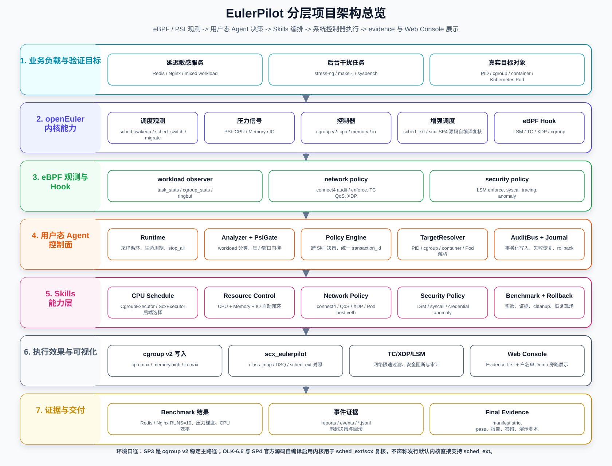

# 系统设计图说明

本文档说明 EulerPilot 当前推荐使用的项目架构图、闭环流程图和阅读口径。旧版 `system_design_zh*.drawio` 仍保留作为历史草稿；后续对外展示优先使用 `docs/assets/` 下的新图。

## 推荐图示

### 1. 分层项目架构总览



用途：README、答辩材料和项目快速介绍。

特点：

- 按七层展示：业务负载、openEuler 内核能力、eBPF Hook、用户态 Agent、Skills、执行效果、证据交付。
- 明确 `Resource / Network / Security / Policy Engine / Web Console` 的位置。
- 在图底部固定写明环境口径，避免把 SP4 发行默认内核误写成直接支持 `sched_ext`。

### 2. 可编辑 draw.io 架构图

- `docs/assets/eulerpilot_architecture_detailed.drawio`
- `docs/assets/eulerpilot_architecture_detailed.spec.yaml`
- `docs/assets/eulerpilot_architecture_detailed.drawio.svg`

用途：需要在 draw.io Desktop 或 VS Code Draw.io 插件中继续编辑时使用。

### 3. Mermaid 源文件

- `docs/assets/eulerpilot_architecture_detailed.mmd`
- `docs/assets/eulerpilot_closed_loop_flow.mmd`

用途：快速调整结构、在 Markdown 中复用、生成 SVG。

## 阅读顺序

建议按以下顺序理解系统：

1. `业务负载与验证目标`
2. `openEuler 内核能力`
3. `eBPF 观测与 Hook`
4. `用户态 Agent 控制面`
5. `Skills 能力层`
6. `执行效果与可视化`
7. `证据与交付`

## 当前核心主线

```text
观测 workload
  -> 聚合 eBPF / PSI / target 状态
  -> 分类 workload 与压力窗口
  -> Policy Engine 选择 Skill 与 target_ref
  -> Resource / Network / Security / scx 后端执行
  -> 审计、rollback、benchmark、evidence 与 Web Console 展示
```

## 统一环境口径

- `SP3`：稳定主路径是 `cgroup v2 + eBPF/PSI + Policy Engine + Skills`。
- `OLK-6.6`：用于提前打通 `sched_ext/scx`、`ScxExecutor`、`class_map` 和 `scx_eulerpilot`。
- `SP4`：发行环境已完成适配验证；`sched_ext/scx` 路径基于 SP4 官方源码自编译启用 `CONFIG_SCHED_CLASS_EXT` 的内核完成复核，不声称发行默认内核直接支持 `sched_ext`。

## 当前实现状态

- 用户态 Agent 已可编译、可运行、可测试。
- `workload_observer.bpf.c` 已提供调度行为观测。
- `ResourceControlSkill` 已完成 CPU + Memory + IO 自动闭环。
- `PolicyEngineSkill` 已完成 Security anomaly 到 Resource/Network 的跨 Skill 联动。
- `NetworkPolicySkill` 已完成 connect4、TC QoS、XDP 与 Pod host veth 验证。
- `SecurityPolicySkill` 已完成 LSM enforce、syscall tracing 和 anomaly 规则验证。
- `ScxExecutor + scx_eulerpilot` 已在 OLK-6.6 与 SP4 自编译启用内核路径完成复核，不作为 SP3 发行默认内核依赖。
- Web Console v1 是旁路展示控制台，只读取已有 CLI、日志和 evidence，不产生新的性能结论。
