# EulerPilot 用户手册

版本：v0.9.0-rc1 用户手册草案  
适用日期：2026-07-26  
适用仓库：`/root/EulerPilot-candidate` 或等价 release candidate/source tree  
主要环境：openEuler 24.03 LTS SP4 主验证环境 + openEuler 24.03 LTS SP3 强制兼容环境

> 本手册面向实际使用者、复现人员和答辩演示人员。它介绍 EulerPilot 的完整使用路径，包括 Agent、配置、eBPF 观测、Policy Engine、cgroup/scx 后端、各 Skill、测试脚本、evidence、rollback 以及 Web Console 演示界面。

> 重要边界：本手册不改变核心业务逻辑，不要求运行正式性能实验，不创建 tag，不 push，不发布 release。涉及 cgroup、BPF、TC/XDP、LSM、sched_ext、Kubernetes 的命令应在专用验证机、独立 namespace/lab 资源和 root 权限下执行。

## 目录

1. 手册使用方式
2. 项目简介
3. 当前交付矩阵
4. 功能总览
5. 仓库目录结构
6. 运行前准备
7. 编译与构建
8. 配置文件说明
9. Agent CLI 使用
10. Agent 运行模式
11. 输出界面与状态解释
12. Workload Observer 与 Analyzer
13. PSI Gate 与自适应策略
14. Resource Control Skill
15. Network Policy Skill
16. Security Policy Skill
17. Policy Engine 跨 Skill 联动
18. sched_ext/scx 后端
19. Kubernetes 与容器 target
20. Web Console 使用
21. Evidence 与结果查看
22. Benchmark 与实验入口
23. Demo 演示流程
24. Metrics Exporter
25. Rollback 与 cleanup
26. 安全边界与默认关闭项
27. 常见操作示例
28. 故障排查
29. 性能结论阅读边界
30. 交付、bundle 与 release 注意事项
31. 截图清单与补图说明
32. 手册自检清单

---

## 1. 手册使用方式

首次使用建议按顺序阅读第 2 到第 10 节，先理解 EulerPilot 的系统边界、环境矩阵、构建方法和 Agent CLI。需要现场演示时，重点阅读第 20 到第 25 节。需要复现实验或检查证据时，重点阅读第 21、22、29、30 节。

本文命令默认在 SP4 主验证仓库执行：

```bash
export EULERPILOT_ROOT=${EULERPILOT_ROOT:-/root/EulerPilot-candidate}
cd "${EULERPILOT_ROOT}"
```

如果你使用的是最终解压后的源码包或 GitLink/GitHub clone，请把 `EULERPILOT_ROOT` 改成实际路径。不要在生产业务 cgroup、生产网卡、系统 namespace 或已有 Kubernetes workload 上直接运行 live/lab 测试。

---

## 2. 项目简介

EulerPilot 是面向 openEuler 的自适应资源管控 Agent。它不是单一调度器 demo，而是一套围绕以下闭环构建的系统级 Agent 框架：

```text
观测 -> 分类 -> 策略决策 -> Skill 执行 -> 审计 -> 回滚 -> 证据
```

核心能力包括：

- 用 eBPF、PSI、LSM、TC/XDP、sched_ext map 等收集 workload 和系统压力信号。
- 在用户态 Agent 中完成 workload 分类、策略门控、target 解析和跨 Skill 编排。
- 通过 cgroup v2、sched_ext/scx、TC、XDP、BPF LSM 等系统控制器执行资源治理或策略验证。
- 通过 AuditBus、ActionJournal、JSONL 事件、report、manifest 和 Web Console 形成可审计证据链。
- 在 Agent stop、失败注入或 cleanup 阶段执行 rollback，并尽量保证只清理 EulerPilot 自有 lab 资源。

项目价值不是宣称所有 workload 永远提升，而是证明系统能观测、决策、执行、回滚，并把收益、代价和边界讲清楚。

---

## 3. 当前交付矩阵

| 环境 | 角色 | 使用口径 |
|---|---|---|
| `192.168.1.123` / SP4 | 主验证和性能实验环境 | 主开发、sched_ext/scx 功能验证、Web、完整集成、最终演示和 release candidate 生成。 |
| `192.168.1.121` / SP3 | 比赛要求强制兼容环境 | 构建、配置校验、cgroup 主闭环、安全扩展 smoke、rollback、safe doctor、sched_ext unavailable graceful fallback。 |
| `192.168.1.122` | 历史 OLK/sched_ext 对照 | 只作为历史验证和回归参考，不作为最终 release 来源。 |

统一表述：SP4/123 是 EulerPilot 的主验证和性能实验环境；SP3/121 是比赛要求的强制兼容交付环境。sched_ext/scx 在 SP4 官方源码自编译启用 `CONFIG_SCHED_CLASS_EXT` 的内核上完成验证；cgroup v2 是官方发行内核上的稳定执行后端。

---

## 4. 功能总览

已注册 Skill 可通过命令查看：

```bash
./build/eulerpilot-agent --list-skills
```

当前主线输出应包含：

```text
network_policy
network_policy_demo
network_qos
network_xdp
policy_engine
psi_gate
resource_control
security_policy
security_policy_demo
```

功能分层如下：

| 层级 | 模块 | 说明 |
|---|---|---|
| 观测层 | `bpf/`、PSI、LSM、TC/XDP、sched_ext stats | 采集 workload、压力、安全事件和调度统计。 |
| 控制层 | `agent/` | Runtime、配置解析、Analyzer、TargetResolver、SkillManager、PolicyEngine。 |
| 执行层 | cgroup v2、scx、TC/XDP、BPF LSM | 执行资源控制、网络策略、安全策略和调度实验。 |
| 证据层 | `reports/`、`results/`、`evidence/`、`dashboard/` | 保存测试结果、事件、图表、manifest 和最终报告。 |
| 展示层 | `web_console/`、`docs/`、`demo/` | Agent 状态展示、白名单演示、答辩材料和用户手册。 |

---

## 5. 仓库目录结构

| 路径 | 用途 |
|---|---|
| `agent/` | C++ 用户态 Agent，包含 Runtime、配置、执行器、Skill 适配层。 |
| `bpf/` | workload observer、network policy、network QoS、XDP、security policy 等 eBPF 程序。 |
| `sched/` | `scx_eulerpilot` sched_ext 调度器和相关 BPF 程序。 |
| `configs/` | 默认配置、Skill 配置、Policy Engine 联动配置、evidence manifest。 |
| `scripts/` | 环境检查、cgroup 初始化、rollback、evidence、quality gate、release bundle 等脚本。 |
| `tests/` | 单元测试、集成测试、benchmark 语义测试和 smoke。 |
| `bench/` | Redis/Nginx、throughput-first、mixed-adaptive、Agent overhead 等实验入口。 |
| `demo/` | 一键演示脚本和说明。 |
| `web_console/` | React + Node.js 演示控制台，集中展示 Agent 状态、证据和白名单动作。 |
| `docs/` | 架构、Skill、演示、报告、状态和本用户手册。 |
| `reports/` | 质量门禁、evidence compact、事件日志、候选状态报告。 |
| `results/` | 集成测试和历史实验结果。 |
| `evidence/` | evidence 状态覆盖、schema 或 release 证据元数据。 |
| `submission/` | 比赛提交说明、构建运行说明和提交清单。 |
| `third_party/reference/` | 参考仓库快照，仅作实现参考，不直接作为生产代码。 |

---

## 6. 运行前准备

### 6.1 基础依赖

建议先执行只读环境检查：

```bash
scripts/check_env.sh
```

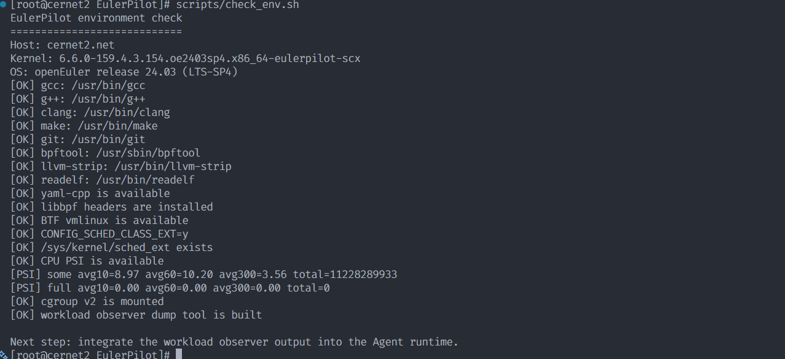

SP4 sched_ext 验证需要自编译启用 `CONFIG_SCHED_CLASS_EXT` 的内核，并保证 `/sys/kernel/sched_ext` 可用。SP3 官方发行内核不要求强行运行 SCX，应验证 graceful fallback。

常见依赖包括：

- `clang`、`llvm`、`bpftool`、`libbpf` 相关开发包。
- `make`、`gcc/g++`。
- `tc` / `iproute2`。
- Node.js 与 npm，用于 Web Console。
- Redis/Nginx/wrk/stress-ng 等 benchmark 依赖，只有跑实验时需要。
- Kubernetes/k3s/kubectl，仅真实 Pod 验证需要。

### 6.2 权限

只读命令通常不需要修改系统状态，但 BPF、cgroup、TC/XDP、LSM、sched_ext 和 Kubernetes live/lab 验证需要 root。建议使用专用验证机，不要在生产环境直接执行。

### 6.3 cgroup v2 初始化

在验证机上初始化 EulerPilot lab cgroup：

```bash
sudo scripts/setup_cgroup_v2.sh
```

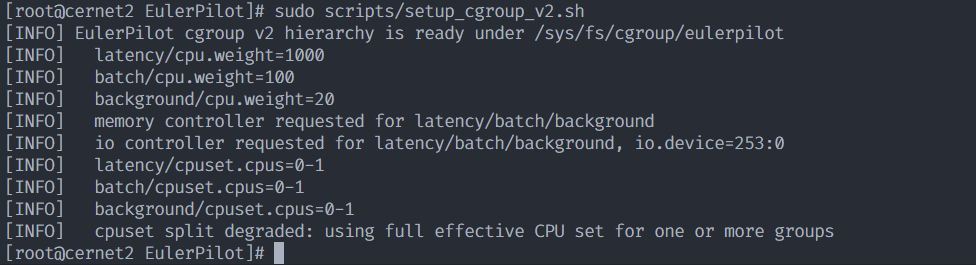

当前 release 默认安全关闭 cpuset，稳定路径使用 `cpu.weight/cpu.max`、memory 和 IO 控制器。只有显式实验才启用 cpuset。

---

## 7. 编译与构建

常用构建命令：

```bash
make agent
make observer
make unit-tests
make network-policy
make network-qos-tc
make network-xdp
make security-policy
```

全部默认目标：

```bash
make all
```

格式检查：

```bash
make format-check
```

清理构建产物：

```bash
make clean
```

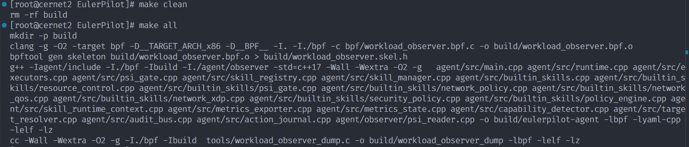

注意：封版流程要求正式 artifact 使用 out-of-tree build 和不可变 artifact 目录，不能直接把 `/usr/local/bin/scx_eulerpilot` 当作正式证据二进制。普通用户学习和 smoke 可以用仓库内构建命令；正式实验必须遵循 release process。

---

## 8. 配置文件说明

### 8.1 默认 Agent 配置

默认配置为 `configs/agent.yaml`：

```yaml
agent:
  name: EulerPilot
  mode: dry-run
  interval_ms: 1000
skills_config_path: skills.yaml
scheduler:
  type: cgroup_v2
exporter:
  prometheus:
    enabled: false
    listen: 127.0.0.1:9108
```

校验配置：

```bash
./build/eulerpilot-agent --validate-config configs/agent.yaml
```

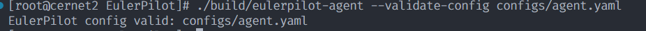

### 8.2 Skill 配置

默认 Skill 配置入口为 `configs/skills.yaml`。它定义各 Skill 是否启用、mode、targets、rules、profiles 和安全边界。

强联动配置独立放在：

```text
configs/policy_engine_security_network_resource.yaml
configs/policy_engine_security_network_resource.skills.yaml
```

校验：

```bash
./build/eulerpilot-agent --validate-config configs/policy_engine_security_network_resource.yaml
```

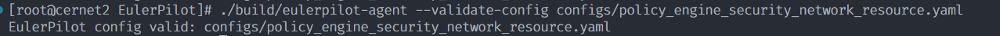

### 8.3 Prometheus 配置

默认 `configs/agent.yaml` 关闭 Prometheus exporter。现场需要展示 metrics 时使用：

```bash
./build/eulerpilot-agent --config configs/agent-metrics.yaml --duration-s 30 --interval-ms 1000 &
curl http://127.0.0.1:9108/metrics
```

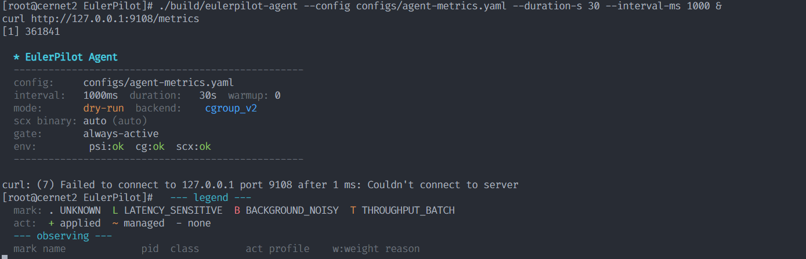

## 9. Agent CLI 使用

Agent 支持的主要命令形态：

```text
./build/eulerpilot-agent [--config PATH]
                         [--interval-ms N]
                         [--duration-s N]
                         [--warmup-cycles N]
                         [--backend cgroup_v2|sched_ext]
                         [--gate-mode always-active|psi|normal]
                         [--active]
                         [--strict]
                         [--verbose]
                         [--jsonl]
                         [--list-skills]
                         [--doctor-safe]
                         [--doctor-skills]
                         [--validate-config PATH]
                         [--status --json]
```

常用只读命令：

```bash
./build/eulerpilot-agent --list-skills
./build/eulerpilot-agent --status --json
./build/eulerpilot-agent --doctor-safe --config configs/agent.yaml
```

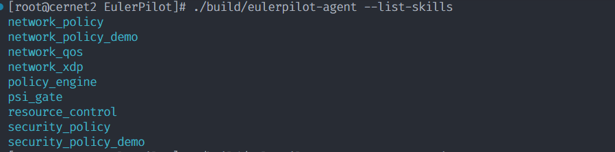

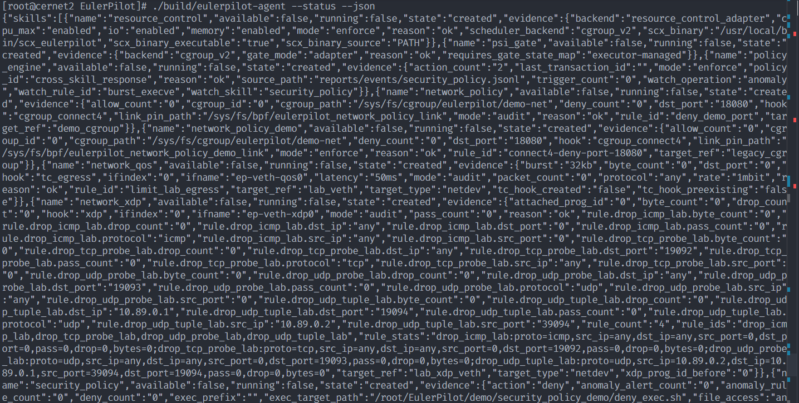

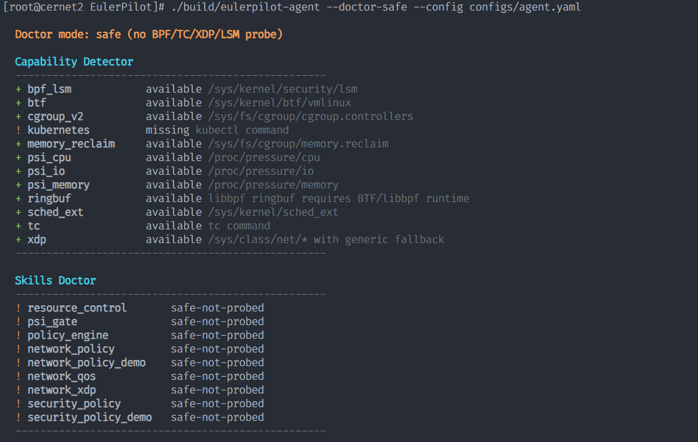

配置校验：

```bash
./build/eulerpilot-agent --validate-config configs/agent.yaml
```

启动一次 dry-run 观测：

```bash
./build/eulerpilot-agent --config configs/agent.yaml --duration-s 10 --interval-ms 1000
```

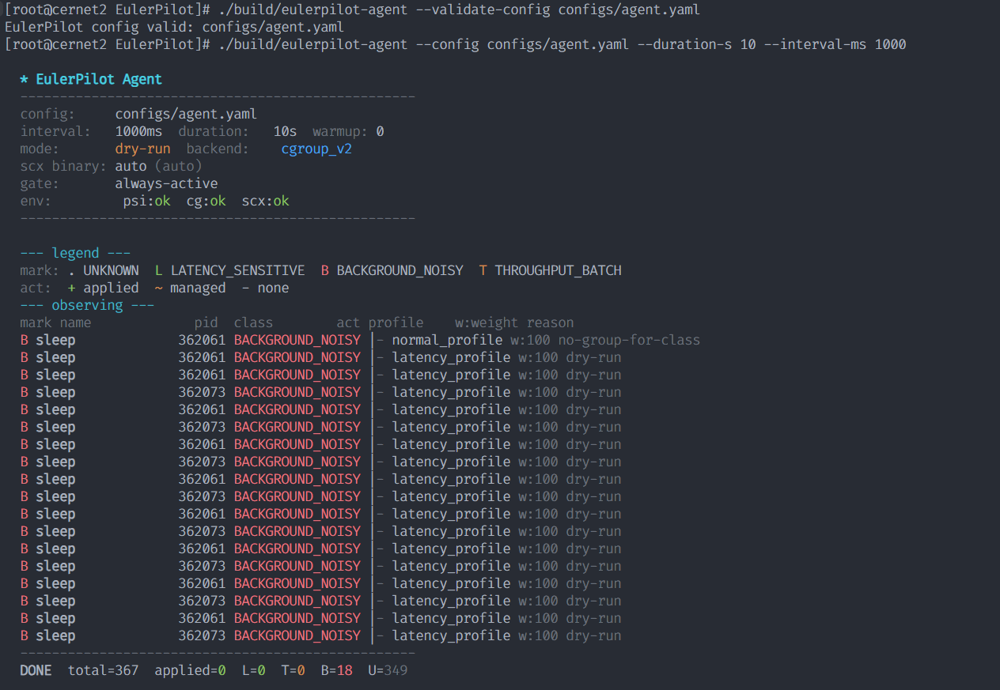

启用 active 模式需要明确知道会写入哪些控制器：

```
sudo ./build/eulerpilot-agent --config configs/agent.yaml --backend cgroup_v2 --gate-mode always-active --active --duration-s 30
```

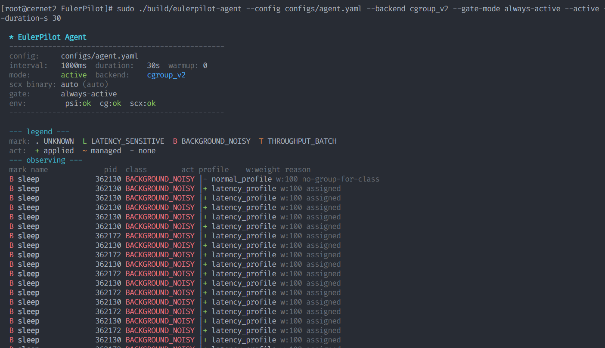

---

## 10. Agent 运行模式

| 模式 | 命令或配置 | 含义 |
|---|---|---|
| dry-run | `agent.mode: dry-run` 或不加 `--active` | 只观测、分类和输出，不写系统控制器。 |
| active | 加 `--active` | 允许启用配置中声明的 enforce/控制动作。 |
| cgroup_v2 backend | `--backend cgroup_v2` | 官方发行内核稳定执行后端。 |
| sched_ext backend | `--backend sched_ext` | 需要自编译启用 sched_ext 的内核和 formal scx artifact。 |
| always-active gate | `--gate-mode always-active` | 不依赖 PSI，适合短时集成测试。 |
| psi gate | `--gate-mode psi` | 依据 PSI 状态机进入 ACTIVE/COOLDOWN。 |
| normal gate | `--gate-mode normal` | 保守模式，通常用于只读或低风险启动。 |

演示 dry-run 输出示例中，`mark` 列含义：

```text
. observe   + apply   ~ manage   - none
L latency   B background   T batch
```

如果看到 `L redis-server ... |~ normal_profile ... no-group-for-class`，说明 Agent 已识别 Redis 为 latency-sensitive，但当前没有对应可管理 cgroup 或处于 dry-run/非写入状态。

---

## 11. 输出界面与状态解释

### 11.1 CLI 表格输出

典型输出结构：

```text
EulerPilot Agent
config: configs/agent.yaml
interval: 1000ms  duration: 10s
mode: dry-run  backend: cgroup_v2
env: psi:ok  cg:ok  scx:--

mark name pid class act profile w:weight reason
```

字段说明：

| 字段 | 说明 |
|---|---|
| `name` | 进程 comm，可能被内核截断。 |
| `pid` | 进程 ID。 |
| `class` | Analyzer 分类结果，如 latency、batch、background 或 unknown。 |
| `act` | 当前动作，`apply/manage/none` 等。 |
| `profile` | 匹配到的资源 profile。 |
| `reason` | 为什么应用或不应用动作，例如 `non-target-process`、`target-scope-mismatch`。 |

### 11.2 status JSON

```bash
./build/eulerpilot-agent --status --json
```

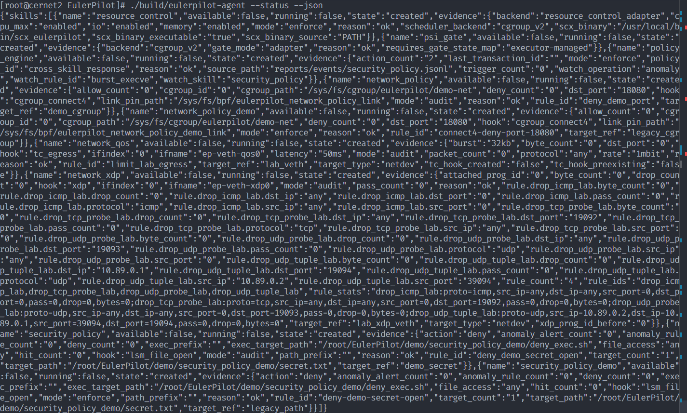

当前输出包含：

- `cpuset_control=disabled`：封版安全策略，当前稳定路径使用 `cpu.weight/cpu.max`。
- `skills[]`：每个 Skill 的 available、running、state、evidence。
- safe status 下 `available=false/running=false/state=created` 不代表功能不可用，而是未启动 live probe；需结合 `reason=ok` 和 doctor/capability 判断。

### 11.3 doctor-safe

```bash
./build/eulerpilot-agent --doctor-safe --config configs/agent.yaml
```

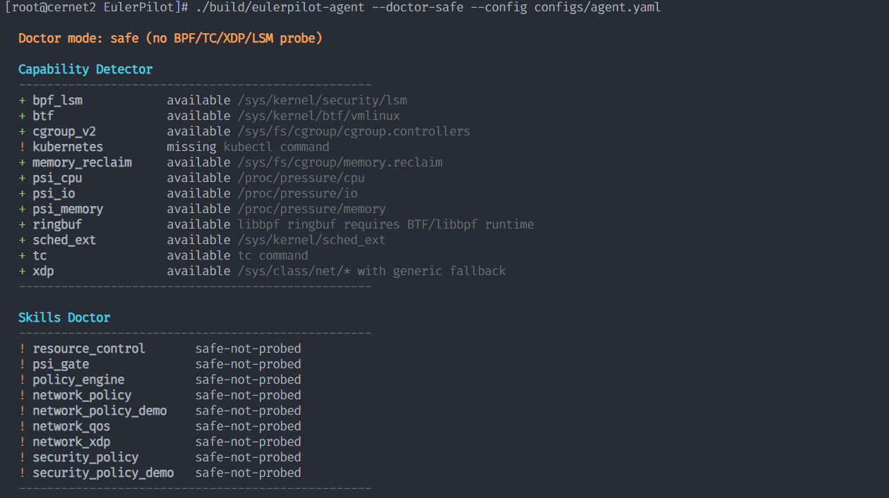

`doctor-safe` 严格只读，不加载 BPF/TC/XDP/LSM，不创建 cgroup。Skill 行显示 `safe-not-probed` 是预期行为。

---

## 12. Workload Observer 与 Analyzer

Observer 负责采集 workload 行为指标，Analyzer 负责把样本分类为 latency-sensitive、throughput/batch、background/noisy 或 unknown。

常见输入信号包括：

- 进程 comm、PID/TID/TGID。
- wait/runtime/wakeup/migration/context switch 类指标。
- PSI pressure。
- sched_ext stats 或 cgroup stats。

封版实现要求使用任务身份和 delta 语义避免 PID/TID 重用、counter reset、无符号下溢和跨任务串样本。用户侧不需要直接操作这些内部结构，但应理解：性能和分类结论必须来自同一 tested commit 和 formal artifact，不能混用旧二进制或旧 trace。

---

## 13. PSI Gate 与自适应策略

PSI Gate 用于把系统压力从“持续写控制器”改为“压力窗口内激活”。状态机口径：

```text
NORMAL -> ARMED -> ACTIVE -> COOLDOWN -> NORMAL
```

使用方式：

```bash
sudo ./build/eulerpilot-agent --backend cgroup_v2 --gate-mode psi --active --duration-s 60
```

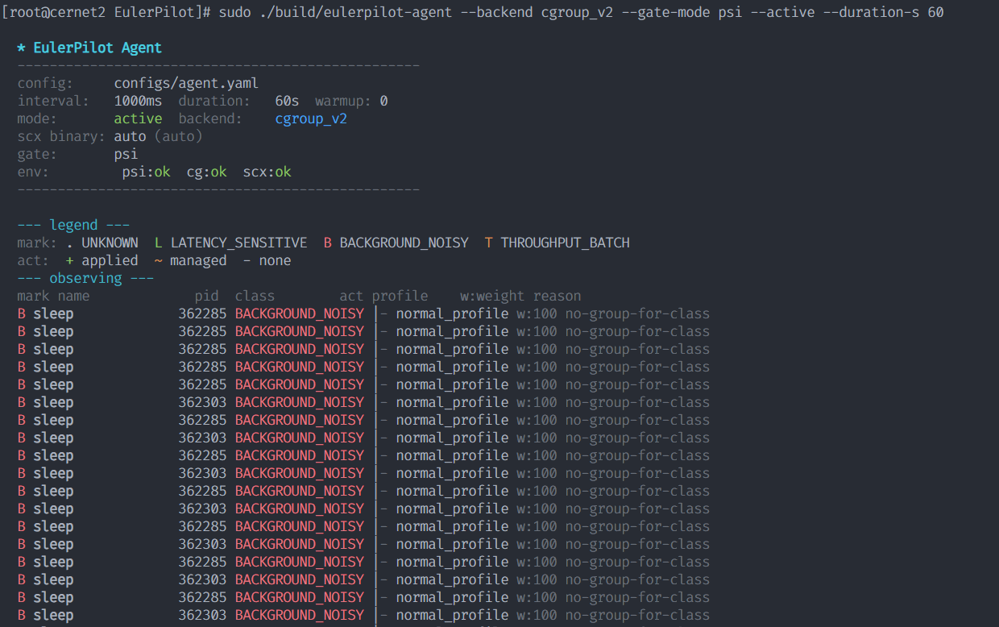

Mixed-Adaptive 验证要求同一个 Agent 实例连续经历 quiet、pressure、recovery，不允许把多个 Agent 的 trace 拼接成闭环。该能力定位为功能闭环验证，不作为净性能提升结论。

---

## 14. Resource Control Skill

Resource Control 是 EulerPilot 的 cgroup v2 主执行 Skill。

### 14.1 能力

- CPU：`cpu.weight`、`cpu.max`。
- Memory：`memory.high`、`memory.low`、`memory.max`。
- IO：`io.weight`、`io.max`。
- target：cgroup、PID、container、container_id、Kubernetes Pod。
- rollback：读取旧值、写入新值、复读验证、失败恢复。

当前 release 默认 `cpuset_control=disabled`，不宣传动态 cpuset 拓扑管控已作为完整能力启用。

### 14.2 快速检查

```bash
./build/eulerpilot-agent --status --json | jq '.cpuset_control, .skills[] | select(.name=="resource_control")'
```

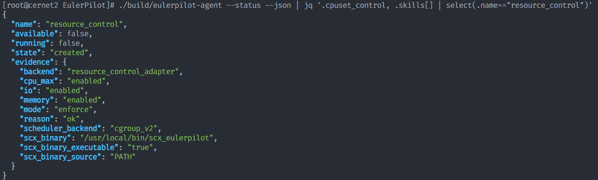

### 14.3 集成测试

```bash
sudo tests/integration/test_resource_control.sh
sudo tests/integration/test_resource_control_io.sh
```

这些测试会写 lab cgroup，必须在验证机执行。测试后应检查无残留：

```
sudo scripts/rollback.sh
```

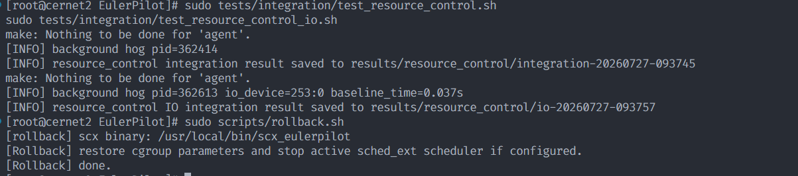

---

## 15. Network Policy Skill

Network Policy 覆盖三类网络能力：

- `cgroup_connect4`：按 cgroup scope 观测或拒绝 connect。
- `network_qos` / TC：在 lab veth 或解析出的 Pod host veth 上做 QoS 限速。
- `network_xdp`：在 isolated veth 或 lab Pod veth 上做 XDP drop/pass 验证。

安全边界：

- 默认只允许 lab 接口：`veth*`、`ep-*`、`lab-*` 或配置显式声明接口。
- 默认拒绝管理网卡、默认路由接口和当前 SSH 路径接口。
- audit 模式必须只读，不应创建或删除 cgroup。
- 外部业务 cgroup 封版默认严格只读。

常用测试：

```bash
sudo tests/integration/test_network_policy.sh
sudo tests/integration/test_network_qos_tc.sh
sudo tests/integration/test_network_xdp.sh
```

清理：

```
sudo scripts/cleanup_network_policy_demo.sh || true
sudo scripts/cleanup_network_qos_tc.sh || true
sudo scripts/cleanup_network_xdp_demo.sh || true
```

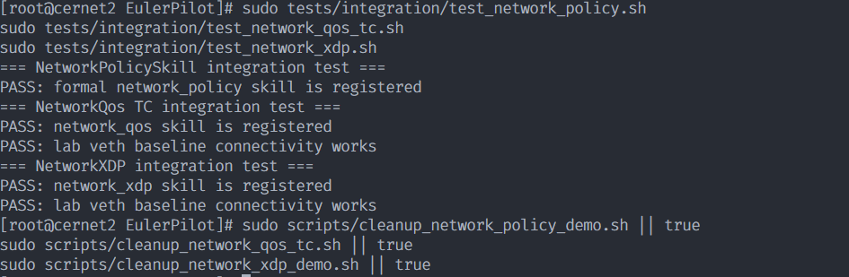

---

## 16. Security Policy Skill

Security Policy 使用 BPF LSM 和 syscall tracepoint 形成安全策略和 anomaly 证据。

### 16.1 能力

- file open / bprm exec / socket connect / ptrace / capability / credential lifecycle 等 LSM hook。
- `execve`、`openat`、`connect`、`ptrace` tracepoint 观测。
- `burst_execve`、`burst_connect`、`burst_openat_sensitive`、`capability_abuse`、`credential_churn` anomaly。
- scoped enforce：file/exec/socket enforce 必须有 target/cgroup scope。

### 16.2 安全口径

如果目标内核不能可靠读取 socket 协议，socket enforce 应 fail-closed 标为 unavailable；不能把“只按端口匹配”描述为 TCP enforce。无 scope 的全局 enforce 在封版配置中应拒绝启动。

### 16.3 测试

```bash
sudo tests/integration/test_security_policy.sh
sudo tests/integration/test_security_policy_anomaly_rules.sh
sudo tests/integration/test_security_policy_credential_anomaly.sh
```

清理：

```
sudo scripts/cleanup_security_policy_demo.sh || true
```

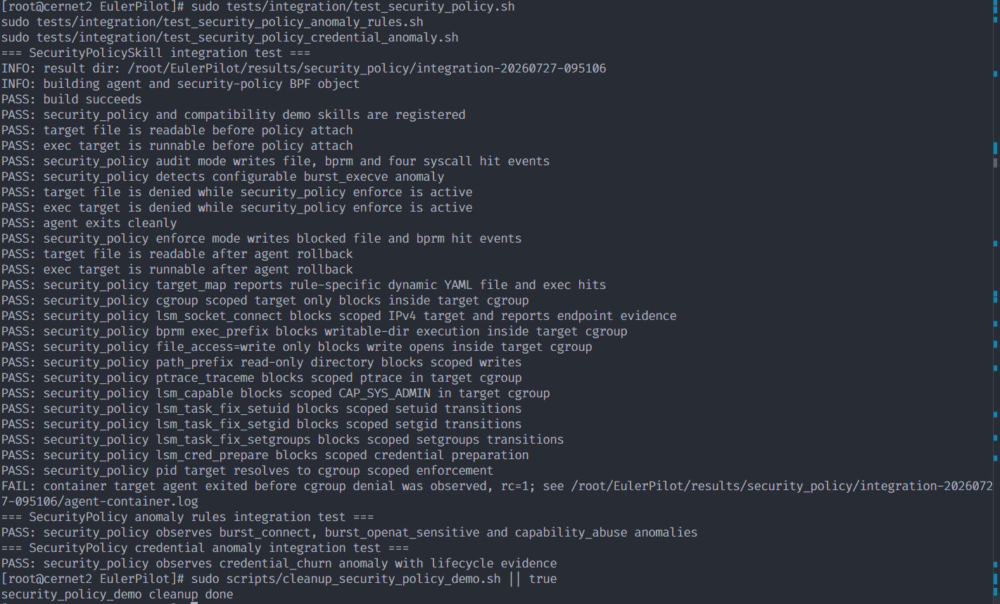

---

## 17. Policy Engine 跨 Skill 联动

Policy Engine 消费 Security anomaly 或其他 Skill 事件，并触发 Resource/Network 等白名单动作。

核心链路：

```text
security_policy burst_connect anomaly
  -> policy_engine decision
  -> resource_control demo_cgroup cpu.max / memory.high
  -> network_qos lab_netdev tc/tbf 2mbit
  -> AuditBus + ActionJournal
  -> Agent stop rollback
```

配置入口：

```bash
./build/eulerpilot-agent --validate-config configs/policy_engine_security_network_resource.yaml
```

主演示测试：

```bash
sudo tests/integration/test_policy_engine_security_network_resource.sh
```

连续验证：

```bash
sudo tests/integration/test_policy_engine_security_network_resource.sh --repeat 10
```

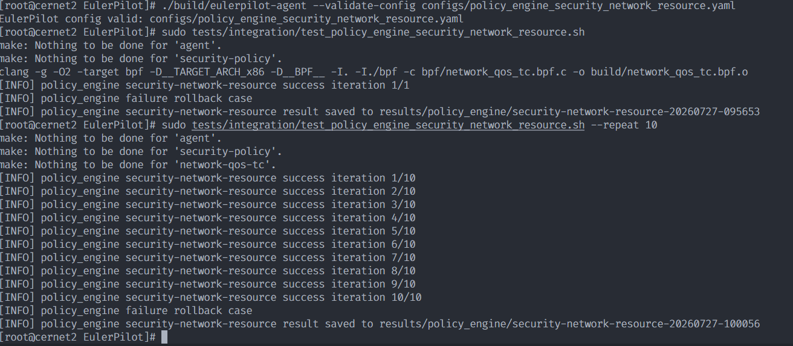

验收时应能用同一个 `transaction_id` 串起：security anomaly、policy decision、resource applied/restored、network applied/restored 和 ActionJournal。

---

## 18. sched_ext/scx 后端

SCX 是增强调度路径，不是 SP3 官方发行内核的强制路径。使用前必须确认：

```bash
test -d /sys/kernel/sched_ext && echo sched_ext-ok
```

构建 scx：

```bash
scripts/build_scx_eulerpilot.sh
```

普通 smoke：

```bash
sudo bench/redis/run_redis_sched_ext_smoke.sh
sudo bench/nginx/run_nginx_sched_ext_smoke.sh
```

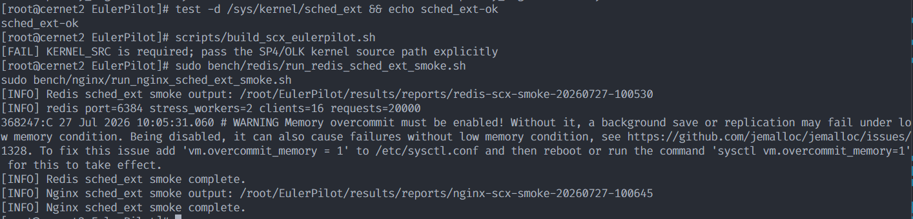

正式实验不能直接使用固定 `/usr/local/bin/scx_eulerpilot`。封版要求从 `tested_code_commit` 的 frozen worktree out-of-tree 构建 formal artifact，并在每轮记录 Agent、observer BPF、SCX binary、SCX BPF object、config、benchmark script 的 SHA256。

性能口径：SCX 控制链和状态记账可证明可运行，但不能宣传为所有 workload 稳定提升。报告必须按 workload 拆分 improved/neutral/regressed。

---

## 19. Kubernetes 与容器 target

EulerPilot 支持把 target 从本机 cgroup 扩展到容器和 Kubernetes Pod，但验证必须旁路、隔离、可清理。

基本要求：

- 使用独立 namespace，例如 `eulerpilot-sp4-validation`。
- 所有资源加统一 label：`app.kubernetes.io/part-of=eulerpilot-validation`。
- Pod/Deployment 设置 CPU/Memory requests 和 limits。
- 不修改 `kube-system`、`varmor`、已有业务 namespace 或现有 workload。
- 验证后用 label selector 二次确认无残留。

只读检查：

```bash
kubectl get nodes
kubectl get pods -A
kubectl get all -A -l app.kubernetes.io/part-of=eulerpilot-validation
```

真实 Pod 联动只作为高级可选演示，环境未确认时不要现场点击 Web Console 的 `policy_engine_real_pod`。

---

## 20. Web Console 使用

Web Console 是 EulerPilot 的演示控制台，用于集中展示 Agent 状态、证据清单、doctor 输出、Policy Engine 时间线和白名单动作。

### 20.1 启动

```bash
cd "${EULERPILOT_ROOT}/web_console"
npm ci
npm run build
cd "${EULERPILOT_ROOT}"
export EULERPILOT_CONSOLE_TOKEN="$(openssl rand -hex 16)"
web_console/scripts/run_console.sh --daemon
```

### 20.2 SSH 隧道

在本地 PowerShell：

```powershell
ssh -N -L 18081:127.0.0.1:18080 openEuler-2403-LTS-SP4
```

浏览器访问：

```text
http://127.0.0.1:18081/?token=<EULERPILOT_CONSOLE_TOKEN>
```

如果服务器禁止端口转发，应使用允许转发的跳板机或让 Web Console 仍保持 loopback，只通过安全隧道访问，不建议直接暴露 `0.0.0.0`。

### 20.3 页面

| 页面 | 用途 |
|---|---|
| Overview | Host、Kernel、Git、Agent、质量门、证据完整度。 |
| Skills & Agent | list-skills、status JSON、doctor-safe、配置校验。 |
| Scheduling & PSI | Redis/Nginx、scx、PSI Gate 和性能图表。 |
| eBPF Extensions | Network/Security/Resource tabs。 |
| Policy Engine Timeline | 按 transaction_id 展示联动链路。 |
| Evidence & Live Demo | Evidence、白名单动作、实时日志和 cleanup。 |

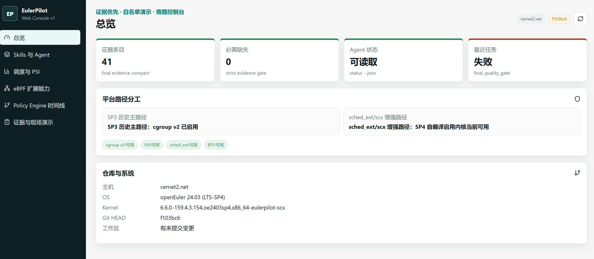

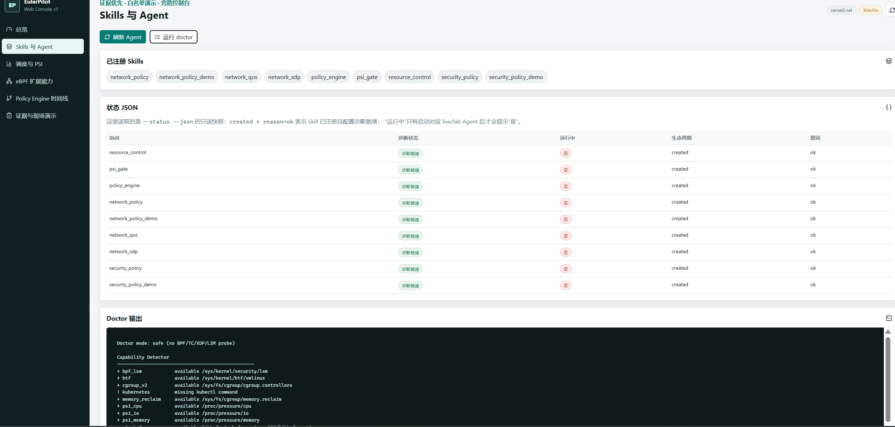

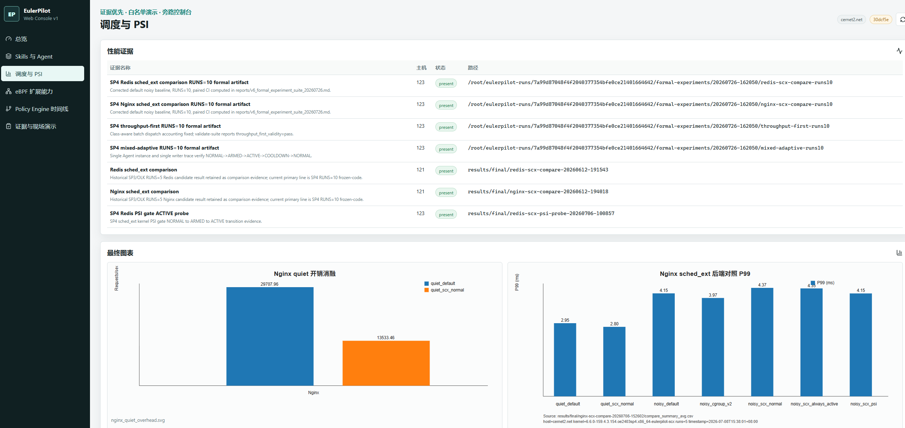

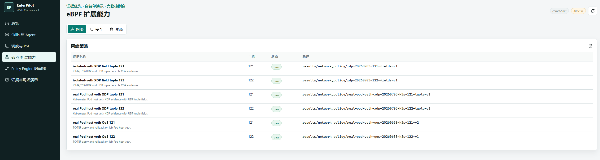

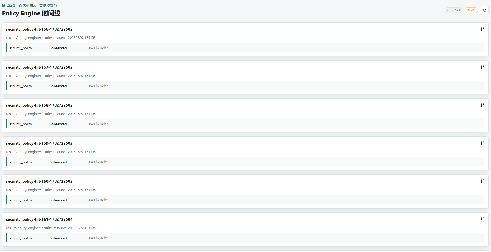

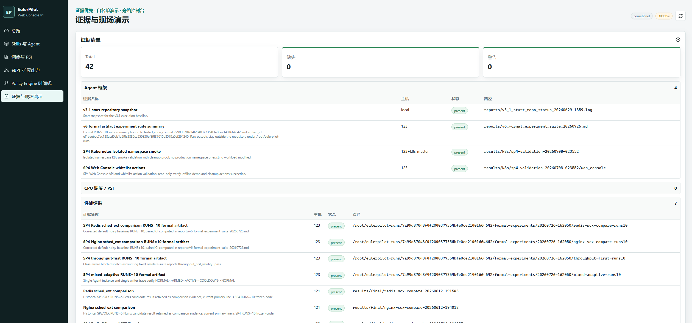

### 20.4 白名单动作

推荐按钮：环境检查、查看 Skills、Agent 状态 JSON、Skill 安全诊断、离线证据演示、跨 Skill 联动实验、清理现场资源。

变更类动作需要 token 和二次确认；同一时间只允许一个 demo/lab/cleanup mutating job。

---

## 21. Evidence 与结果查看

查看 final evidence：

```bash
python3 scripts/collect_final_evidence.py --validate-release \
  --output-json /tmp/eulerpilot_evidence.json \
  --output-md /tmp/eulerpilot_evidence.md
```

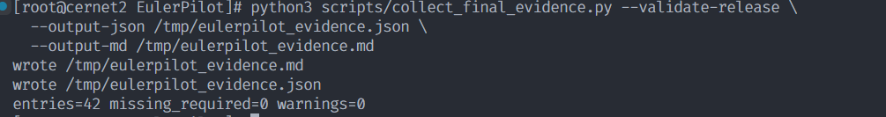

当前候选状态可输出：

```text
entries=42 missing_required=0 warnings=0
```

常用证据入口：

| 文件 | 说明 |
|---|---|
| `configs/final_evidence_manifest.json` | evidence manifest。 |
| `reports/final_evidence_compact.md` | 紧凑证据汇总。 |
| `docs/final_evidence_index.md` | 人类可读证据索引。 |
| `reports/v6_formal_experiment_suite_20260726.md` | v6 formal suite 汇总。 |
| `evidence/evidence_status_overrides.json` | 旧证据状态覆盖，不改原始数据。 |

旧数据不删除，但被标为 historical/provisional/invalid 的内容不得作为 final positive evidence。

---

## 22. Benchmark 与实验入口

常见实验脚本：

```bash
bench/redis/run_redis_sched_ext_compare.sh
bench/nginx/run_nginx_sched_ext_compare.sh
bench/throughput/run_throughput_first_benchmark.sh
bench/mixed/run_mixed_adaptive_closure.sh
bench/redis/run_static_vs_agent_compare.sh
bench/redis/run_redis_pressure_gradient.sh
```

正式实验规则：

- 必须先确认 `tested_code_commit`、formal `artifact_id`、clean source tree。
- 实验输出应写仓库外目录，例如 `/root/eulerpilot-runs/<tested_code_commit>/...`。
- Redis/Nginx 使用随机化完整 block 或平衡顺序。
- 每轮保存命令、host、kernel、boot ID、CPU topology、governor、tool versions、hash、cleanup result。
- CPU/10k 如果不是独立采样窗口，只能作为 exploratory 指标。

普通用户不要为了查看 Web 或文档而运行正式 benchmark。

---

## 23. Demo 演示流程

离线演示：

```bash
demo/demo_all_final.sh --mode offline
```

live 演示：

```bash
sudo demo/demo_all_final.sh --mode live
```

清理：

```bash
sudo demo/demo_all_final.sh --cleanup
```

推荐视频顺序：

1. README 和架构图：解释项目不是单一调度器，而是 OS Agent 框架。
2. `--list-skills`：展示 9 个 Skill。
3. `--status --json`：解释 cpuset disabled、skills state、safe status。
4. `--doctor-safe`：说明 safe doctor 无副作用。
5. Web Console：展示 Overview、Evidence、Skills、Policy Timeline。
6. Evidence：展示 42 条 evidence 和 release validation。
7. Policy Engine lab：如现场允许，运行主演示链路。
8. cleanup：验证无 lab cgroup/veth/qdisc 残留。
9. 说明性能边界：cgroup 在部分 Redis/Nginx 场景收益明确，SCX 按 workload 拆分。

---

## 24. Metrics Exporter

默认关闭。需要时使用专用配置：

```bash
./build/eulerpilot-agent --config configs/agent-metrics.yaml --duration-s 30 --interval-ms 1000 &
curl http://127.0.0.1:9108/metrics
```

注意：只监听 loopback；演示结束后停止 Agent。

---

## 25. Rollback 与 cleanup

总清理入口：

```bash
sudo scripts/rollback.sh
sudo demo/demo_all_final.sh --cleanup
```

专项清理：

```bash
sudo scripts/cleanup_network_policy_demo.sh || true
sudo scripts/cleanup_network_qos_tc.sh || true
sudo scripts/cleanup_network_xdp_demo.sh || true
sudo scripts/cleanup_security_policy_demo.sh || true
```

原则：

- 只清理 EulerPilot 自有 lab 资源。
- 不迁移非本事务管理的 PID。
- 不删除外部业务 cgroup。
- TC/XDP 只卸载本次 attach 的对象。
- cleanup 失败必须显式报告，不能覆盖 primary failure。

---

## 26. 安全边界与默认关闭项

封版默认关闭或限制：

- NetworkXDP 管理网卡危险模式。
- TC 修改已有非自有 qdisc。
- `doctor --live-probe`。
- `memory.reclaim`。
- 外部业务 cgroup 写入。
- 无法可靠确认 ownership 的 rollback。
- 未通过目标内核验证的 Security/LSM rule。
- 任何 `restore_not_guaranteed` 动作。
- cpuset 动态拓扑控制。

Web Console 默认只监听 loopback；mutating action 需要 token、二次确认和单任务锁。

---

## 27. 常见操作示例

### 27.1 首次只读验证

```bash
export EULERPILOT_ROOT=/root/EulerPilot-candidate
cd "${EULERPILOT_ROOT}"
make agent
./build/eulerpilot-agent --validate-config configs/agent.yaml
./build/eulerpilot-agent --list-skills
./build/eulerpilot-agent --status --json
./build/eulerpilot-agent --doctor-safe --config configs/agent.yaml
```

说明词：这组命令证明 Agent 可构建、配置可校验、Skill 已注册、状态可结构化读取，且 safe doctor 不会改变系统状态。

### 27.2 观察 dry-run 输出

```bash
./build/eulerpilot-agent --config configs/agent.yaml --duration-s 5 --interval-ms 1000
```

说明词：dry-run 只观测和分类，不写 cgroup/scx/TC/XDP/LSM。输出表格里的 reason 可以解释为什么某个进程未被管理。

### 27.3 Policy Engine lab 演示

```bash
sudo tests/integration/test_policy_engine_security_network_resource.sh
```

说明词：这条链路展示 Security anomaly 触发 Policy Engine，再同时调用 Resource Control 和 Network QoS，最后通过 rollback 恢复。

### 27.4 Web Console 离线展示

```bash
cd web_console
npm run build
cd ..
web_console/scripts/run_console.sh --daemon
```

说明词：Web Console 把 Agent 状态、证据清单、doctor 输出和白名单演示集中展示出来，便于现场按固定流程复现项目能力。

---

## 28. 故障排查

| 现象 | 可能原因 | 处理 |
|---|---|---|
| `--status` 中 Skill `available=false` | safe status 未执行 live probe | 结合 `reason=ok`、doctor-safe 和具体测试判断；这不等于功能缺失。 |
| Web 按钮被拒绝 `mutation_token_required` | 未设置 `EULERPILOT_CONSOLE_TOKEN` | 设置 token 后重启 Web Console，并在 URL 中带 `?token=...`。 |
| SSH 隧道报 administratively prohibited | SSH 服务端禁用端口转发 | 使用允许转发的跳板机或调整 SSH 服务端策略；不要直接暴露 root 控制台。 |
| SCX 无法启动 | 内核未启用 sched_ext 或 artifact 不匹配 | 先使用 cgroup_v2 后端；SCX 只在 SP4 自编译内核和 formal artifact 下验证。 |
| `doctor-safe` 显示 `safe-not-probed` | 预期行为 | safe doctor 不加载探针，需 live/integration 才能验证实际 attach。 |
| benchmark 数字与报告不同 | 可能是旧 evidence/provisional 或不同 tested commit | 查看 `evidence_status_overrides.json`、run manifest、tested commit 和 artifact id。 |

---

## 29. 性能结论阅读边界

当前正式口径：

- cgroup v2 是官方发行内核上的稳定执行后端。
- Redis GET/INCR 和部分 Nginx 场景在修正 baseline 后可呈现正向收益，但应按具体 workload、RUNS 和 CI 解释。
- SCX 控制链、DSQ 记账和 mixed-adaptive 状态闭环可运行；性能可能 improved、neutral 或 regressed，不能笼统宣传稳定全面提升。
- Mixed-Adaptive 是功能闭环验证，不是净性能实验。
- Agent overhead 应以 CPU 占用、RSS 和运行模式说明。

阅读报告时优先看：effect summary、paired 95% CI、每轮原始点、validity、performance_result、artifact provenance、cleanup result。

---

## 30. 交付、bundle 与 release 注意事项

封版前应区分：

| 名称 | 含义 |
|---|---|
| `tested_candidate_commit` | 候选源码 SHA，必须通过 candidate-bound gates。 |
| `tested_code_commit` | 全部门禁对同一 SHA 通过后确认的正式被测源码。 |
| `artifact_id` | 由源码、构建脚本、编译器、依赖、BTF、环境白名单等计算出的不可变构建产物身份。 |
| `release_candidate_commit` | 实验后加入报告、图表、evidence、release 元数据的候选提交。 |
| `release_commit` | 最终 release gate 通过后确认的提交。 |

正式 release bundle 应在仓库外生成，避免 manifest 自引用导致 commit SHA 失效。未经明确要求，不 push 分支、不 push tag、不创建远端 Release。

---

## 31. 截图清单与补图说明

截图目录：

```text
docs/assets/user-manual/
```

截图清单：

```text
docs/assets/user-manual/screenshot_manifest.md
```

本次手册先写入截图位和拍摄要求，不伪造截图。建议正式录屏或提交前补以下图片：

| ID | 建议文件名 | 内容 |
|---|---|---|
| UM-01 | `um-01-overview.png` | Web Console Overview 页面，显示 SP4/SP3 交付矩阵和 evidence。 |
| UM-02 | `um-02-skills-agent.png` | Skills & Agent 页面，显示 9 个 Skill 和 status JSON。 |
| UM-03 | `um-03-evidence.png` | Evidence 页面，按评分项展示 evidence。 |
| UM-04 | `um-04-policy-timeline.png` | Policy Engine Timeline，按 transaction_id 展示链路。 |
| UM-05 | `um-05-live-demo.png` | Live Demo 页面，显示 Recommended Demo 和 cleanup。 |
| UM-06 | `um-06-cli-dry-run.png` | CLI dry-run 表格输出。 |
| UM-07 | `um-07-doctor-safe.png` | safe doctor 输出。 |
| UM-08 | `um-08-release-evidence.png` | `collect_final_evidence.py --validate-release` 输出。 |

---

## 32. 手册自检清单

| 检查项 | 状态 |
|---|---|
| 文件中文命名为 `docs/用户手册.md` | 已完成 |
| 覆盖 Agent、配置、Observer/Analyzer、PSI、cgroup/scx、Skills、Web、Evidence、Demo、Rollback | 已完成 |
| 明确 SP4 主验证 + SP3 强制兼容矩阵 | 已完成 |
| 未把 SP4 发行默认内核写成直接支持 sched_ext | 已检查 |
| 未把 Web Console 写成实验数据源 | 已检查 |
| 未宣传 cpuset 动态拓扑为封版完整能力 | 已检查 |
| 未把旧 historical/provisional 结果当作 final positive evidence | 已检查 |
| 提供截图清单和占位说明 | 已完成 |
| 不运行正式性能实验 | 已遵守 |
| 不 push、不 tag、不 release | 已遵守 |
| 不修改 `agent/`、`bpf/`、`sched/` 主干 | 已遵守 |

### 本次手册编写时实际验证过的只读命令

```bash
./build/eulerpilot-agent --list-skills
./build/eulerpilot-agent --status --json
./build/eulerpilot-agent --validate-config configs/agent.yaml
./build/eulerpilot-agent --doctor-safe --config configs/agent.yaml
python3 scripts/collect_final_evidence.py --validate-release --output-json /tmp/eulerpilot_user_manual_evidence.json --output-md /tmp/eulerpilot_user_manual_evidence.md
```

### 本次未执行的命令

未执行正式 benchmark、live TC/XDP/LSM/sched_ext attach、Kubernetes 写入验证、release bundle、tag、push 和远端 Release。需要这些内容时，请按封版流程和验证矩阵另行执行。
